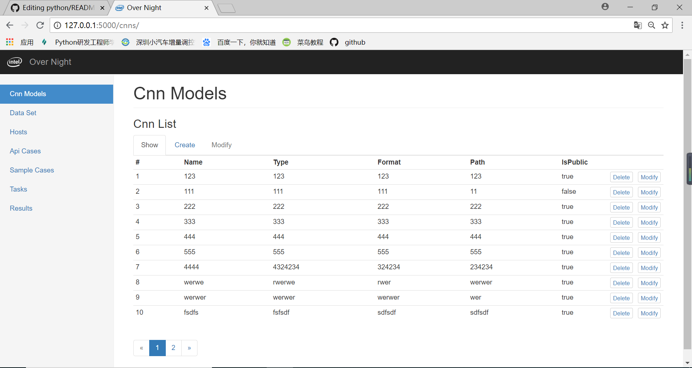

### 页面显示

### 功能
    -页面可以进行数据增删改查，把数据通过ajax传到后台数据库
    -通过提取数据库数据作为自动化测试的必要参数和数据，进行自动化测试
    -测试完毕后，把测试结果和测试log存放入数据库，然后提取数据传给页面进行渲染

### nginx install
    -官网：http://nginx.org/
### 配置nginx
    -config目录：/etc/nginx/conf.d
    -修改default.conf，先备份
    -修改内容：
    server {
    listen       80;
    server_name  10.240.109.106;

    charset utf-8;
    #access_log  /var/log/nginx/host.access.log  main;

    location / {
        include uwsgi_params;
        proxy_pass  http://0.0.0.0:8010;
    }
        ---其他不变
### 启动nginx
    -sudo nginx
### 退出nginx
    -sudo nginx -s quit
### 测试nginx配置文件是否正确
    -sudo nginx -t <配置文件>
###uwsgi install
    -pip install uwsgi
### uwsgi 配置
    -创建配置文件xxx.ini(文件名自定义)
    -内容：
    [uwsgi]
        # 使用nginx连接时 使用
        ;socket=0.0.0.0:8010
        # 直接作为web服务器使用
        http=0.0.0.0:8010
        # 配置工程目录
        chdir=/home/matt/matt/FlaskTest/OverNight
        # 配置项目的wsgi目录。相对于工程目录
        wsgi-file=manager.py
        # 项目应用名称
        callable=app
        #配置进程，线程信息
        processes=4
        threads=2
        enable-threads=True
        master=True
        pidfile=uwsgi.pid
        daemonize=uwsgi.log
### 启动uwsgi
    -uwsgi --ini <配置文件>
### 退出uwsgi
    -ps -ef | grep uwsgi
    -kill -9 <进程id>

