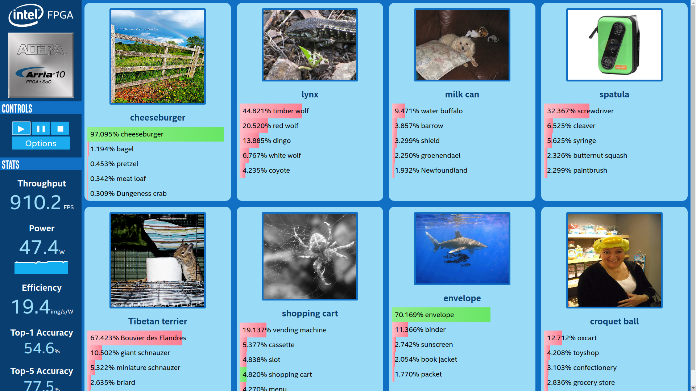

### 页面显示

### 功能
#### 显示inference后的结果：
      -top5
      -精度
      -fps
      -功率
      -结果准确度
      -...
#### 可以切换多种网络进行测试
      -GoogleNetV1
      -Alexnet
      -VGG_16
      -Resnet-18
      -...
#### 可以切换多种平台进行测试
      -HDDL（MYX）
      -CPU
      -GPU
      -FPGA
      -...
#### 页面点击开始测试后，每秒刷新一次，每次页面显示8张图片的测试结果，并显示该图片的top5值，红色代表错误结果，绿色代表正确结果，点击停止后，测试停止
    
