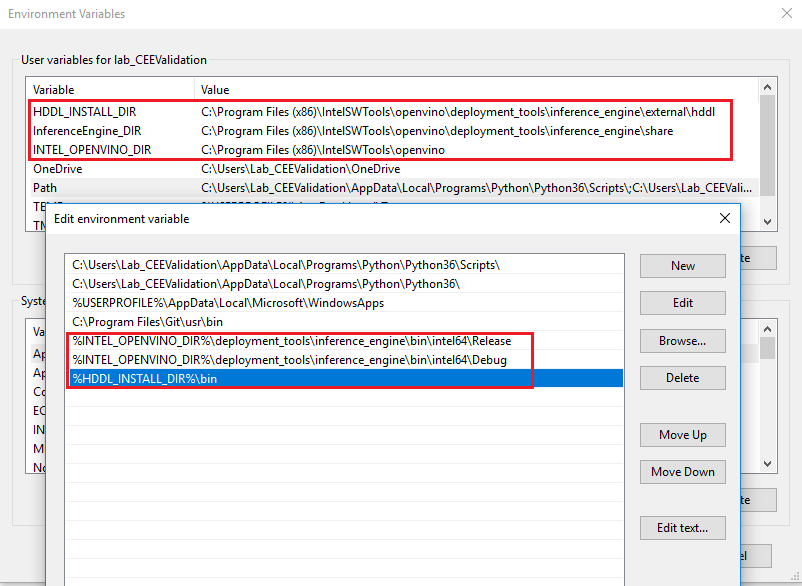
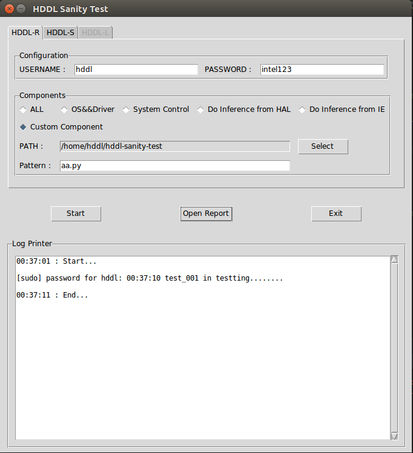

### HDDL Sanity Auto Test Tools
#### HDDL-R && HDDL-L
1. Follow the user guide to install openvino and also dependence, after the installation finished, please checked and make sure below items are OK:
    1. "${HDDL_INSTALL_DIR}/bin/hddldaemon" can run normally
    2. cd "${INTEL_CVSDK_DIR}/deployment_tools/model_optimizer/install_prerequisites", "xxxx_tf.sh/xxxx_caffe.sh" was installed
2. Install the dependencies
    - sudo apt-get install python3-yaml libusb-1.0-0-dev libudev-dev libssl-dev rpm cmake libboost-program-options1.58-dev
    - sudo apt-get install libboost-thread1.58 libboost-filesystem1.58 git libudev-dev libjson-c-dev libprotobuf-dev libtinyxml2-dev python3-tk
    - pip3 install -r requirements.txt  (if prompt pip3 command not found, run "sudo apt install python3-pip")
3. Windows
    - Set the system variables like below:
        
    - Manully compile hddl-bsl
#### HDDL-S
1. According to the hddls_server_install.txt to install
2. pip3 install pexpect
#### Custom Component
1. Create your test cases with python unittest
2. Select the Custom Component
3. Select the path for your cases
4. Input the pattern(test_*.py) or name(aa.py) for your cases under the path
#### Run Demo
- Double click the sanity_test_GUI
- Input the configuration for your test
- Select the component that you want to test
- Click the Start button

    
